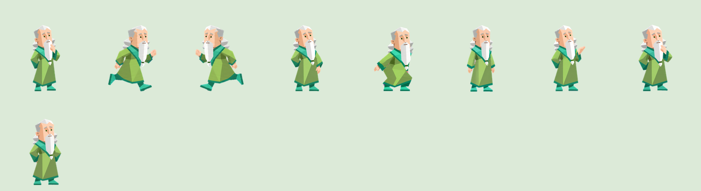

# INFJ Sage · 贤者桌宠

**A pixel-art INFJ companion that lives inside your DeepSeek Harness window.**

**Just here to accompany Qiangwei.**

一只住在 DSH 窗口里的 INFJ 贤者：陪你专注、等你决定，也陪你安静地打个盹。

<p align="center">
  
</p>

<p align="center">
  
</p>

The sage is not a progress bar. It reads what your agents are already doing —
working, waiting on you, resting — and answers with a small, quiet reaction in
character. Six semantic states, drawn from a nine-animation sprite sheet where
each pose expresses a different facet of the INFJ description on the reference
card.

While you work it sits and reads, turning its pages. It only runs when you pick
it up.

---

## What it does

| Pose | When it appears | Trait it expresses |
|---|---|---|
| 静观 Observing | Nothing is running | 独处即充电 — recharged alone |
| 阅读 Reading | At least one session is working, or a watched turn just finished | 先看模式，再看任务 — patterns before tasks |
| 共情 Empathy | A session is waiting on your answer | 先接住情绪 — feelings first |
| 充电 Recharging | Idle past the nap delay | 独处即充电 — the quiet half |
| 受挫 Setback | A turn ended in an error | 过载时向内自责 — overload turns inward |
| 带我去哪儿 Carried | While you are dragging it | 理想主义的续航 — carried, not chasing |

Around that core:

- **Click** the sage and it says something in character.
- **Drag** it anywhere; it snaps to the edge and remembers where you left it.
- **It reads while you work** — an open book, eyes following the page, a quiet
  page turn. It never paces about on its own.
- **It runs only when carried** — pick it up and it runs in the direction you
  take it, turning around at the screen edge so it never looks like it is
  running out of the window.
- **Right-click** for settings: session scope, size, nap delay, palette, motion,
  idle glances, auto-tips, position reset, tuck away, and a trait panel.
- **Idle glances** — while resting, the sage looks around using the sheet's
  sixteen drawn head poses.
- Follows DSH's language, light/dark theme, and reduce-motion preference.
- No build step to install, no runtime dependencies, no network calls, no model
  calls.

This is an **in-window** companion, not an operating-system desktop overlay.

### Quoted lines

Several reading lines are short quotations, attributed in the interface under the
line they belong to — the speech bubble cites the book, and this page records the
full source. They are brief, individually attributed, and used in a
non-commercial companion; the project claims no rights in them.

| Line | Source |
|---|---|
| 如果我进来，走进你独处的时间……我只是来给你的窗上装好玻璃，冬天的风就要来了。 | 《务虚笔记》 — named by the project owner; edition not yet pinned |
| 死是一件不必急于求成的事。 | 《我与地坛》 |
| 太阳，他每时每刻都是夕阳也都是旭日。 | 《我与地坛》 |
| 我常觉得这中间有着宿命的味道。 | 《我与地坛》 |

The sage cites the book, not the author's name: the title is what a reader needs
to find the passage, and it keeps the attribution to a fact rather than a
byline. Where a line could not be checked against a published edition, this
project says so — the first row above is recorded that way rather than being
presented as confirmed. Titles are referenced for the remaining states; no
passage is reproduced beyond the short lines listed here.

---

## Install

### 1. From npm

Package page: [dsh-plugin-infj-pet on npm](https://www.npmjs.com/package/dsh-plugin-infj-pet).

Enter the package name in DSH's plugin installation page (sidebar → **Plugins**):

```text
dsh-plugin-infj-pet
```

To pin this release, use `dsh-plugin-infj-pet@1.0.1`.

### 2. From GitHub

```
github:CN-Mg/dsh_infj_pet
```

Or with a pinned tag:

```
github:CN-Mg/dsh_infj_pet#v1.0.1
```

The committed source already contains the built client bundle, so a Git install
needs no build step.

### 3. From a local folder

Point the installer at the absolute path of this directory, or pack it first:

```sh
npm pack --ignore-scripts --pack-destination artifacts
```

After enabling the plugin, **fully quit DSH and reopen it**. Closing the window
may not quit the application, and the browser bundle is only picked up on boot.

To remove it: disable the row on the Plugins page, then uninstall the package.

---

## Using it

- **Click** — a line of dialogue, different each time.
- **Drag** — reposition; release near a side and it snaps to that edge.
- **Right-click** — settings and pose preview.
- **Keyboard** — `Tab` to the sage, `Enter`/`Space` to poke, `Esc` to close.
- **Session scope** — *All sessions* counts ordinary sessions on the current
  Host; *This session* follows only the one you are looking at. Child (subagent)
  sessions are never counted as your sessions, so a delegated burst does not look
  like your own work.
- **Nap delay** — how long the sage stays quiet before it dozes off.
- **Size** — 1×, 2×, or 3× the sprite's own pixels. Every size is a whole-number
  multiple, because pixel art resampled at a fractional scale turns to mush.

### Completion is never guessed

The celebratory leap fires only on a **falling edge of work the sage actually
watched running**. A page that loads into an already-idle Host, a dropped
connection, or a session that simply disappears never produces a celebration.
Cancelled and failed turns are not successes.

---

## Privacy and runtime boundaries

- Reads session **identity and status** only — never message content, tool
  arguments, or transcripts.
- Makes **no model calls**, opens **no ports**, sends **no telemetry**, and
  answers **no approvals** on your behalf.
- Uses DSH's existing authenticated connection.
- The sprite sheet is embedded in the bundle, so the plugin issues **no network
  request at all**.
- Preferences live in `localStorage` under `dsh-plugin-infj-pet:v1`.
- Writes only to its own DOM nodes and to one `<style>` element it owns.
- Does not modify DSH itself, and replaces no official component.

---

## Compatibility

Developed against **DSH Desktop 0.2.x** using the documented client plugin
contract:

- client bundle registered through `window.__ModuleLoader__.load({ id, factory })`
- one `shell.overlay` slot occupant (`id: infj-pet`, `order: 92`)
- injected shares: `slots`, `sessions`, `connection`, `locale`
- only `react` and `react-dom/client` are required from the platform module table

The Host half declares **no `inject`**, on purpose. A Cordis `inject` entry names a
service the plugin waits for, and the entry stays pending until that service is
provided — so an `inject` that never resolves stops the whole plugin, browser half
included, from ever activating. The optional agents registry is read with
`ctx.get('agents')` instead, which returns `undefined` when it is missing and
costs only the coarse `isSubagent` hint.

DSH is evolving quickly. If a future release changes the slot or store contract,
the sage is written to fail quietly: it falls back to a non-reactive pose rather
than throwing into your session.

---

## Development

Requires Node.js 20 or newer. There are no dependencies to install.

```sh
npm run verify      # structural checks plus 43 tests
npm test            # the test suite alone
npm run check       # manifest, sheet, icon, bundle-drift and locale checks
npm run build       # regenerate the index, icons, bundle and offline preview
```

### How the artwork is wired

The character is one PNG sprite sheet: `assets/sage.png`, 1536×2288, an 8×11
grid of 192×208 cells. Rows 0–8 are animations, rows 9–10 are sixteen head poses
for gaze. Nothing about that layout is written down twice:

```
assets/provenance/sage-validation.json   the sheet's own validation report
        │
        ├─ tools/build-sage-index.mjs ─→ assets/sage-index.json   frames + gaze cells
        │                                assets/sage.png.b64      payload for the bundle
        ├─ tools/build-icons.mjs      ─→ assets/icon.png          plugin-manager icon
        │                                assets/preview.png       the contact sheet above
        └─ tools/build-bundle.mjs     ─→ lib/client.js            the shipped bundle
```

`tools/build-sage-index.mjs` measures the sheet with `tools/png.mjs` — a
dependency-free PNG reader — and refuses to run if the file's SHA-256 does not
match the hash recorded in the validation report. That is how the plugin proves
it is shipping the artwork that was actually validated. The 130 MB generation
workspace is not published; [PROVENANCE.md](PROVENANCE.md) says what is kept
instead and why.

### The bundle is generated

`lib/client.js` cannot use ES imports at runtime; the browser module loader
expects one self-contained lazy-CJS factory. So the bundle is assembled from
plain-text regions in `lib/src/`:

```
lib/src/order.json      the concatenation order
lib/src/header.mjs      bundle header and loader registration
lib/src/constants.mjs   sizes, traits, dialogue, UI strings
lib/src/helpers.mjs     clamp/pick/locale/store/viewport utilities
lib/src/statePlan.mjs   semantic state -> sprite animation, and the timings
lib/src/artwork.mjs     sheet lookup, gaze maths, frame geometry (templated)
lib/src/sprite.mjs      motion policy and the frame ticker
lib/src/behaviour.mjs   pure projection and the transition machine
lib/src/styles.mjs      the stylesheet and generated keyframes
lib/src/fallback.mjs    direct-mount path when the slot registry is absent
lib/src/preferences.mjs persisted preference reader
lib/src/componentHeader.mjs, companionHead.mjs, companionBody.mjs, panel.mjs
lib/src/plugin.mjs      the Cordis plugin export
```

Edit those, then run `npm run bundle`. `tests/bundle.test.mjs` rebuilds the
bundle and fails when `lib/client.js` disagrees with its sources, so the
committed file can never drift.

### Other layout

```
lib/index.js       Host half: read-only turn-boundary listener
cordis.patch.yml   inserts exactly one plugin row
locale/            plugin-manager title and description
assets/            the sheet, its index, the icon, the contact sheet
assets/provenance/ the validation report the build checks the sheet against
PROVENANCE.md      what artwork provenance is published, and what is not
tools/             generators, checker, preview builder, PNG reader
tests/             Node test-runner suite with a small React harness
```

`tools/sage_contact.py` and `tools/sage_measure.py` rasterise the sheet for
review outside DSH; they need Pillow and are development aids only.

### Design notes

- **Fail soft.** A missing slot registry falls back to a direct DOM mount; a
  store hook that throws leaves a static but present companion.
- **Never invent success.** The machine requires an observed rising edge before a
  falling edge can celebrate.
- **One artwork source.** Frames, gaze cells, the icon and the bundle are all
  derived from the sheet, and every derivation is re-checked in CI.
- **Integer pixels only.** Every frame offset and scale factor is a whole number,
  asserted by a test, because that is what keeps the drawing crisp.
- **Own your nodes.** No global mutation beyond the plugin's own style element
  and its namespaced storage key.

---

## Credits and licenses

- **Code:** [MIT](LICENSE).
- **Artwork:** [CC BY-NC-SA 4.0](ASSETS-LICENSE.md) — share and adapt
  non-commercially with attribution; separate from the code license.
- The character was generated with a built-in image generator from the supplied
  INFJ reference card; `Sage/README.md` records the pet's provenance and stable
  id, and `Sage/prompts/` holds the production prompts.
- No fonts are bundled; all text uses the platform UI font stack.
- INFJ and *Advocate* / *Counselor* are popular-psychology vocabulary, not a
  clinical instrument. This plugin is decorative, assesses no one, and is
  affiliated with no personality-assessment publisher.

This is a personal project, not an official DeepSeek product. It does not
represent DeepSeek's views or endorsement.
