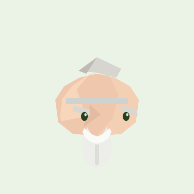

# INFJ Sage · 贤者桌宠

**A low-poly INFJ companion that lives inside your DeepSeek Harness window.**

一只住在 DSH 窗口里的 INFJ 贤者：陪你专注、等你决定，也陪你安静地打个盹。

<p align="center">
  
</p>

The sage is not a progress bar. It reads what your agents are already doing —
working, waiting on you, resting — and answers with a small, quiet reaction in
character. Six poses, each one expressing a different facet of the INFJ
description on the reference card.

---

## What it does

| Pose | When it appears | Trait it expresses |
|---|---|---|
| 静观 Observing | Nothing is running | 独处即充电 — recharged alone |
| 洞察 Insight | At least one session is working | 先看模式，再看任务 — patterns before tasks |
| 共情 Empathy | A session is waiting on your answer | 先接住情绪 — feelings first |
| 笃定 Resolve | A turn the sage watched just finished | 低调地笃定 — quiet conviction |
| 充电 Recharging | Idle past the nap delay | 理想主义的续航 — idealist stamina |
| 受挫 Setback | A turn ended in an error | 过载时向内自责 — overload turns inward |

Around that core:

- **Click** the sage and it says something in character.
- **Drag** it anywhere; it snaps to the edge and remembers where you left it.
- **Right-click** for settings: session scope, size, nap delay, palette, motion,
  auto-tips, and a panel explaining the six traits.
- **Tuck away** hides the sage down to a corner restore button.
- Follows DSH's language, light/dark theme, and reduce-motion preference.
- No build step, no runtime dependencies, no network calls, no model calls.

This is an **in-window** companion, not an operating-system desktop overlay.

---

## Install

### 1. From npm

```
dsh-plugin-infj-pet
```

Enter that name in DSH's plugin installation page (sidebar → **Plugins**). To
pin this release, use `dsh-plugin-infj-pet@1.0.0`.

### 2. From GitHub

```
github:CN-Mg/dsh-plugin-infj-pet
```

Or with a pinned tag:

```
github:CN-Mg/dsh-plugin-infj-pet#v1.0.0
```

The committed source already contains the built client bundle, so a Git install
needs no build step.

### 3. From a local folder

Point the installer at the absolute path of this directory, or pack it first:

```sh
npm pack --ignore-scripts --pack-destination artifacts
```

After enabling the plugin, **fully quit DSH and reopen it**. Closing the window
may not quit the application, and the browser bundle is only picked up on boot.

To remove it: disable the row on the Plugins page, then uninstall the package.

---

## Using it

- **Click** — a line of dialogue, different each time.
- **Drag** — reposition; release near a side and it snaps to that edge.
- **Right-click** — settings and pose preview.
- **Keyboard** — `Tab` to the sage, `Enter`/`Space` to poke, `Esc` to close.
- **Session scope** — *All sessions* counts ordinary sessions on the current
  Host; *This session* follows only the one you are looking at. Child (subagent)
  sessions are never counted as your sessions, so a delegated burst does not
  look like your own work.
- **Nap delay** — how long the sage stays quiet before it dozes off.

### Completion is never guessed

The celebratory pose fires only on a **falling edge of work the sage actually
watched running**. A page that loads into an already-idle Host, a dropped
connection, or a session that simply disappears never produces a celebration.
Cancelled and failed turns are not successes.

---

## Privacy and runtime boundaries

- Reads session **identity and status** only — never message content, tool
  arguments, or transcripts.
- Makes **no model calls**, opens **no ports**, sends **no telemetry**, and
  answers **no approvals** on your behalf.
- Uses DSH's existing authenticated connection.
- Preferences live in `localStorage` under `dsh-plugin-infj-pet:v1`.
- Writes only to its own DOM nodes and to one `<style>` element it owns.
- Does not modify DSH itself, and replaces no official component.

---

## Compatibility

Developed against **DSH Desktop 0.2.x** using the documented client plugin
contract:

- client bundle registered through `window.__ModuleLoader__.load({ id, factory })`
- one `shell.overlay` slot occupant (`id: infj-pet`, `order: 92`)
- injected shares: `slots`, `sessions`, `connection`, `locale`
- only `react` and `react-dom/client` are required from the platform module table

The Host half declares no required service and registers one optional listener,
so a Host-side change degrades the companion rather than failing the plugin.

DSH is evolving quickly. If a future release changes the slot or store contract,
the sage is written to fail quietly: it falls back to a non-reactive pose rather
than throwing into your session.

---

## Development

Requires Node.js 20 or newer. There are no dependencies to install.

```sh
npm run verify      # structural checks plus 34 behavioural tests
npm test            # the test suite alone
npm run check       # manifest, patch, locale, artwork-drift and asset checks
npm run preview     # regenerate preview.html from the shipped assets
```

The artwork lives in exactly one place, `lib/art.js`. The browser bundle cannot
import it, so `tools/build-art.mjs` copies a marked region into `lib/client.js`
verbatim, and `npm run check` **fails** whenever the two copies drift. Edit the
drawing in `lib/art.js`, then run:

```sh
node tools/build-art.mjs --write    # refresh the bundle region and assets/
```

`tools/render_preview.py` rasterises the shipped SVGs into a contact sheet for
reviewing the drawing without launching DSH. It understands only the SVG subset
this project emits, and it ignores stroke-only shapes, so treat it as a
geometry check rather than a pixel-exact preview.

### Layout

```
lib/art.js         artwork source of truth (geometry only)
lib/client.js      browser bundle: one lazy-CJS factory, CSS, state machine, UI
lib/index.js       Host half: read-only turn-boundary listener
cordis.patch.yml   inserts exactly one plugin row
locale/            plugin-manager title and description
assets/            generated SVGs: icon plus one still per pose
tools/             art generator, checker, preview builders
tests/             Node test-runner suite with a small React harness
```

### Design notes

- **Fail soft.** A missing slot registry falls back to a direct DOM mount; a
  store hook that throws leaves a static but present companion.
- **Never invent success.** The state machine requires an observed rising edge
  before a falling edge can celebrate.
- **One artwork source.** Geometry is generated, not hand-copied, and drift is a
  test failure.
- **Own your nodes.** No global mutation beyond the plugin's own style element
  and its namespaced storage key.

---

## Credits and licenses

- **Code:** [MIT](LICENSE).
- **Artwork:** [CC BY-NC-SA 4.0](ASSETS-LICENSE.md) — share and adapt
  non-commercially with attribution; separate from the code license.
- No fonts are bundled; all text uses the platform UI font stack.
- INFJ and *Advocate* / *Counselor* are popular-psychology vocabulary, not a
  clinical instrument. This plugin is decorative, assesses no one, and is
  affiliated with no personality-assessment publisher.

This is a personal project, not an official DeepSeek product. It does not
represent DeepSeek's views or endorsement.
